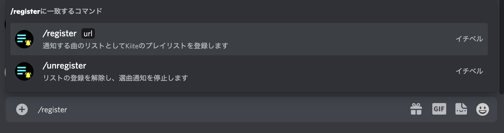
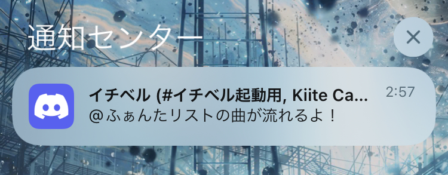
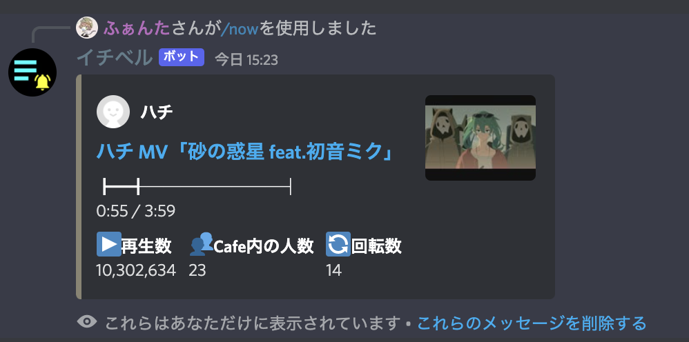

# イチベル
**流れるときにいないお前が悪い**
## 概要
ボカロ曲を布教したりされたり作業用BGMにしたり、回ったり叫んだり狂ったりできる神サイト、[Kiite Cafe](https://cafe.kiite.jp)で好きな曲が流れる1分前に通知するDiscordBotです。  
通知時点では登録したプレイリストのどの曲が流れるかは分かりません。Cafeで流れ始めると確認できるようになります。  
botを動かしている環境（Glitch）の都合上、半日おきくらいに再起動され、再起動中の5分程度は通知が行われません。  
その他にもさまざまな要因で止まることがあります。お守り程度にご活用ください。  

## サーバーへの登録
[このリンク](https://discord.com/api/oauth2/authorize?client_id=932282973997375488&permissions=0&scope=applications.commands%20bot)からサーバーにイチベルを追加できます。また、イチベルと共通のサーバーがあればイチベルとのDMでも各機能を使用することができます。  

## 使い方
まずはリストを登録しましょう！  
チャットで使う枠に`/`（半角スラッシュ）を入れればメニューが出てくるので、`/register`コマンドを選択し、続けてKiiteのプレイリストのURLを入力するだけです。  
  
後は放っておくだけです！リストに入っている曲がCafeで流れる1分前にメンションでお知らせします。  
  
なおCafeの仕様上、通知が来てからCafeに入ってもハートやイチ推しマークは表示されません。  

## コマンド一覧
### /now
今のCafe内の状況を表示します。  
  

### /register
Kiiteのプレイリストを通知対象として登録します。  
`url`オプションで登録するプレイリストのURL（`https://kiite.jp/playlist/〜`）を指定します。  
通知はリストを最後に登録、または更新したチャンネルで行われます。  
同時に登録できるリストは1つだけです。リストを変更する際はもう一度`/register`コマンドを実行してください。  

### /update
今登録しているプレイリストの情報を最新のものに更新します。  
また、通知するチャンネルもこのコマンドを実行したチャンネルに変更します。  
> [!WARNING]  
> このコマンドを実行しない限り、Kiiteでリストの更新を行なっても通知には反映されません。  

### /unregister
プレイリストの登録を解除して通知をやめさせます。  
チャンネルの管理権限を持っていれば`target`オプションで他の人を指定して解除させることもできます。  
他の人を指定した場合、対象としたユーザーにメンションで通知され、またその実行結果はあなた以外も閲覧できます。  

### /list
イチベルに登録しているプレイリストの詳細を確認できます。  
`limit`オプションで1ページに表示する曲数を指定できます。  
`sort`オプションで曲の表示順も変えられます。  

### /timetable
Cafeでの選曲履歴を表示します。  
`limit`オプションで1ページに表示する曲数を指定できます。  

## 何かあったら
[@fantaji_cps](https://twitter.com/fantaji_cps)まで  
Discordでもどうぞ→fanta0328  
